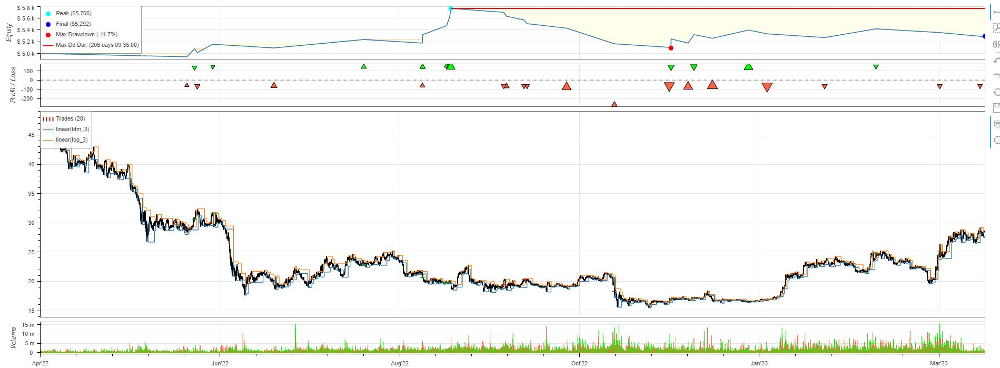
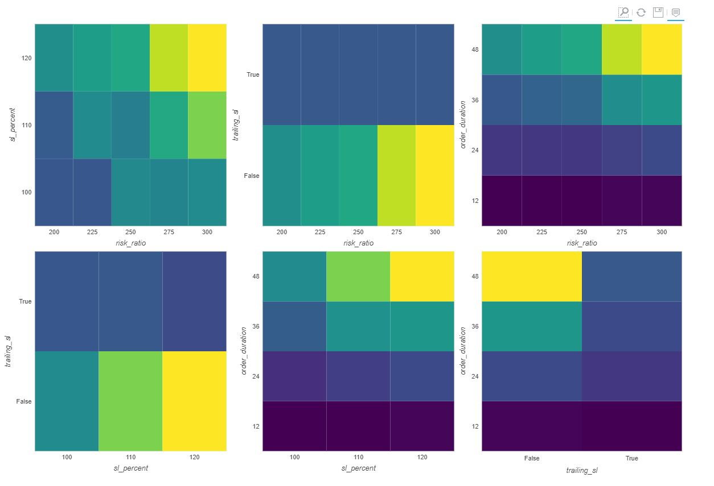
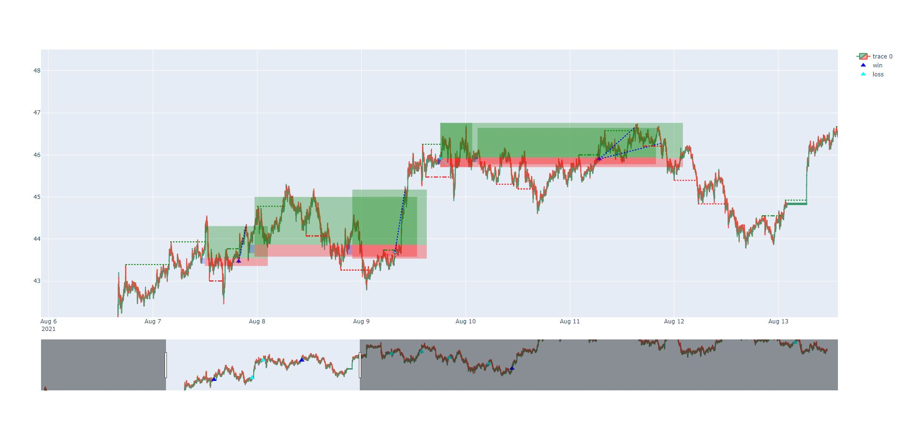

# Backtesting Trading Strategies

## Description
This project is a trading strategy that integrates concepts from the Smart Money Concept Indicator, specifically focusing on bullish and bearish order blocks across three different temporalities. Utilizing the Backtesting.py library, the tool is designed to simulate and optimize trading strategies in historical market conditions, offering insights into the potential viability and profitability of these strategies.

### Key Features:
- Integration of bullish and bearish order blocks from the Smart Money Concept Indicator.
- Multi-temporality analysis to determine aligned trading signals.
- Automatic trade placement when all three temporalities coincide in direction.
- Parameter optimization feature, allowing variation in temporalities, trade direction, swing length, etc.

### Visual Insights

#### Simulated trades example

*Complete simulated run of trades with a specific strategy and parameters*

#### Heatmaps

*Heatmap illustrating optimization of specific parameters*

#### Order Blocks and Trades

*Example of traded order blocks*

## Installation

Follow these steps to set up and run the project:

### Prerequisites

- **Python**: The project is built using Python. If you don't have Python installed, download and install it from [python.org](https://www.python.org/downloads/). Ensure you have Python 3.6 or later.

- **CSV with Ticker Data**: You need a CSV file containing ticker data for backtesting. Place this file in the `backtest_data` folder within the project directory.

### Setup

1. **Clone the Repository**: First, clone the repository to your local machine:

   ```
   git clone https://github.com/jmlacasa/backtesting_simulation.git
   cd your-project-name
   ```

2. **Install Required Libraries**: Use the `requirements.txt` file to install the necessary Python libraries. Run the following command:

   ```
   pip install -r requirements.txt
   ```

3. **Prepare the Data**: Ensure you have the CSV file with your ticker data. The file should be placed in the `backtest_data` folder of your project directory. The file should be in the correct format as expected by the scripts.

### Running the Project
After installation, you can run your scripts or modules within the project's directory.

- LuxAlgo for the Smart Money Concept Indicator

## Built With
- [Backtesting.py](https://github.com/kernc/backtesting.py) - Python framework for backtesting trading strategies.